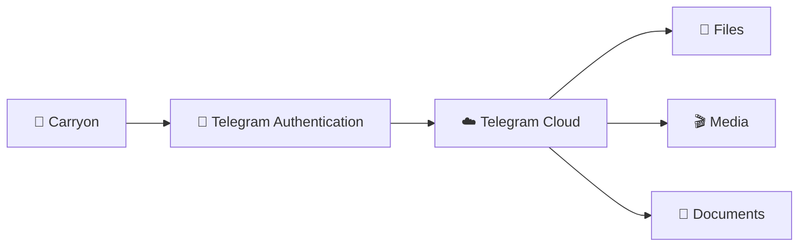
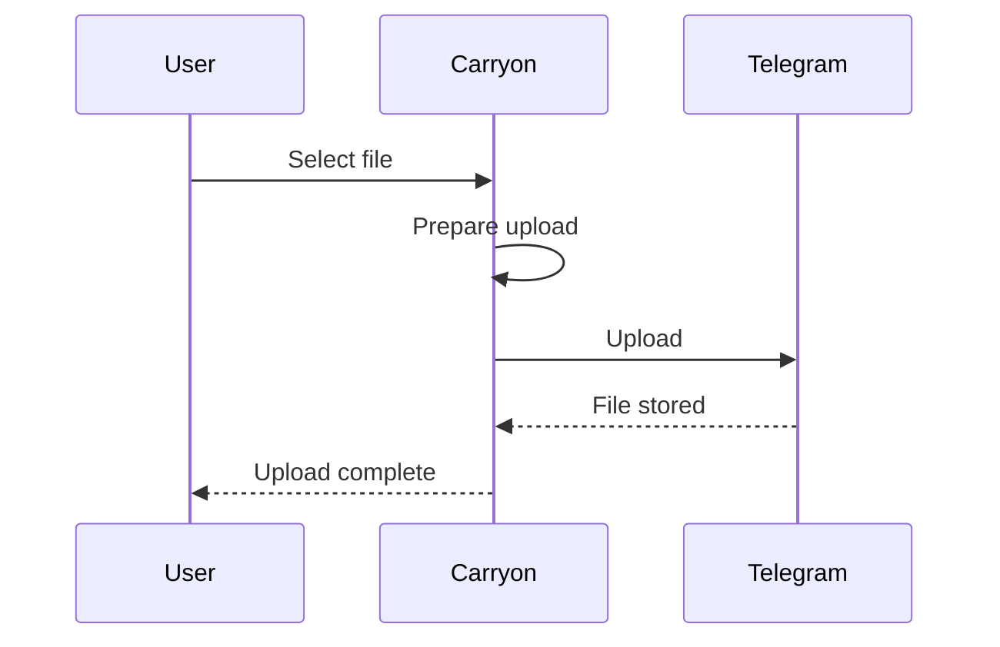
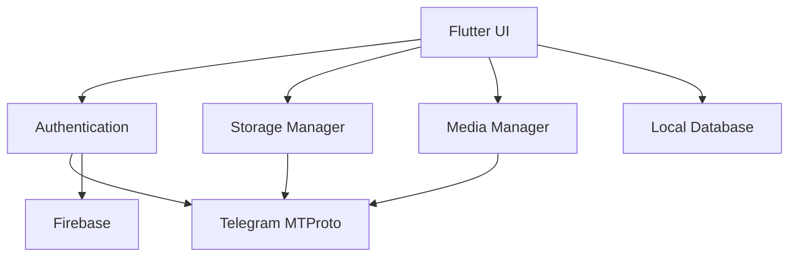

# Carryon

<p align="center">
  
</p>

<p align="center">
  <b>Your files. Your Telegram. Your cloud.</b><br>
  A Flutter app that turns Telegram into your personal cloud storage.
</p>

<p align="center">
  
  
  
</p>

---

## Screenshots

<p align="center">
  
  
  
  
</p>

---

## Features

* ☁️ Telegram-powered cloud storage
* 🔐 MTProto + Telegram 2FA
* 📁 Automatic file categorization
* 🎬 Photo, video, audio and document previews
* ⚡ Background upload/download
* 🔄 Resume interrupted transfers
* 🌙 Dynamic light/dark theme
* 🔔 In-app update checker
* 🐛 Built-in bug reporting

---

## How it works



---

## Upload Flow



---

## Architecture



---

## Tech Stack

| Layer          | Technology     |
| -------------- | -------------- |
| UI             | Flutter        |
| Language       | Dart           |
| Cloud Storage  | Telegram       |
| Protocol       | MTProto        |
| Authentication | Google Sign-In |
| Backend Sync   | Firebase       |
| Platform       | Android        |

---

## Run

```bash
flutter pub get
flutter run
```

Build:

```bash
flutter build apk --release
```

---

## Release

Update `pubspec.yaml`:

```yaml
version: 1.0.1+2
```

Then:

```bash
flutter build apk --release
```

APK:

```text
build/app/outputs/flutter-apk/app-release.apk
```

---

<p align="center">
  Built with ❤️ using Flutter
</p>
